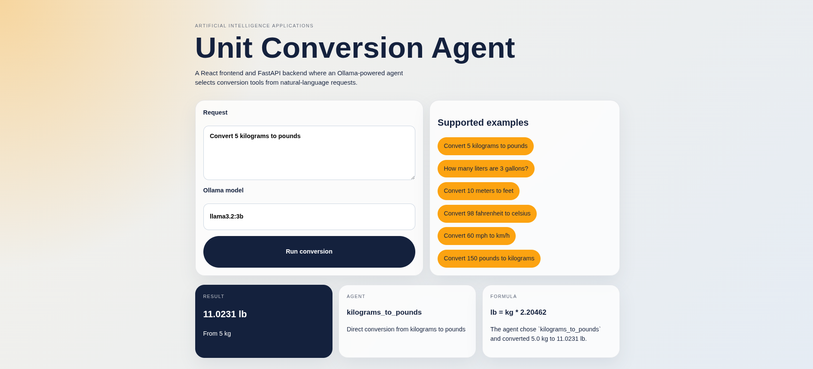

# Unit Conversion Mini-Project

This repository contains a unit conversion tool for the Artificial Intelligence Applications mini-project. The solution is split into a React frontend and a FastAPI backend. The backend exposes an Ollama-driven agent that selects from conversion tools based on the user's natural-language request.

## Project Structure

```text
unit_conversion/
├── backend/
│   ├── app/
│   │   ├── agent.py
│   │   ├── config.py
│   │   ├── main.py
│   │   ├── models.py
│   │   └── tools.py
│   └── requirements.txt
├── frontend/
│   ├── src/
│   │   ├── App.jsx
│   │   ├── main.jsx
│   │   └── styles.css
│   ├── index.html
│   ├── package.json
│   └── vite.config.js
└── promptfoo/
    ├── basic-conversions.yaml
    └── extended-evaluation.yaml
```

## Assignment Coverage

### Part 1

- React user interface in `frontend/`
- FastAPI API in `backend/`
- Six conversion tools:
  - Kilograms to pounds
  - Pounds to kilograms
  - Gallons to liters
  - Meters to feet
  - Fahrenheit to Celsius
  - Miles per hour to kilometers per hour
- Agent-based orchestration in `backend/app/agent.py`
- Ollama used as the LLM provider

### Part 2

- Promptfoo evaluation files split into multiple configs in `promptfoo/`
- Six Ollama models prepared across the evaluation configs
- Rubric-based evaluation added to each config

## Backend Setup

1. Create a virtual environment.
2. Install dependencies:

```bash
cd backend
python3 -m venv .venv
source .venv/bin/activate
pip install -r requirements.txt
```

3. Start Ollama and ensure the model is available:

```bash
ollama serve
ollama pull llama3.2:3b
```

4. Start the API:

```bash
uvicorn app.main:app --reload
```

The API runs on `http://localhost:8000`.

## Frontend Setup

```bash
cd frontend
npm install
npm run dev
```

The frontend runs on `http://localhost:5173`.

## Frontend Screenshot



## API Documentation

### `GET /health`

Returns a simple health response with the configured Ollama base URL.

### `POST /convert`

Request body:

```json
{
  "user_input": "Convert 5 kilograms to pounds",
  "model": "llama3.2:3b"
}
```

Response body includes:

- Selected model
- Agent reasoning
- Tool call
- Conversion result
- Human-readable explanation

## Agent Design

The backend uses one agent, `ConversionAgent`, to interpret the natural-language request. The agent sends a system prompt and user prompt to Ollama and asks the model to return structured JSON describing which tool to call and with which numeric value.

If Ollama is unavailable or returns invalid output, the backend falls back to a simple rule-based matcher for development convenience. The primary design is still LLM-first.

## Tools

Each unit conversion is implemented as a separate tool function in `backend/app/tools.py`. This matches the assignment requirement that the different conversions must be tools available to the agent.

## Model Choice

Document the chosen production model here after evaluation. Suggested candidates already included in Promptfoo configs:

- `llama3.2:3b`
- `llama3.1:8b`
- `mistral:7b`
- `qwen2.5:7b`
- `gemma2:9b`
- `phi3:3.8b`

Add in the report:

- Why the final model was selected
- Quality vs. speed tradeoff
- Which models failed on specific evaluation cases

## Prompt Documentation

### System Prompt

The backend system prompt is stored in `backend/app/agent.py`. It instructs the model to:

- Act as a unit-conversion agent
- Select exactly one tool
- Return JSON only
- Extract one numeric value

### User Prompt Pattern

The backend sends:

- The available tools with descriptions
- The user request in natural language


## Evaluation Documentation

Run Promptfoo with each config and capture screenshots for the report attachments.

Example commands:

```bash
promptfoo eval -c promptfoo/basic-conversions.yaml
promptfoo eval -c promptfoo/extended-evaluation.yaml
```

